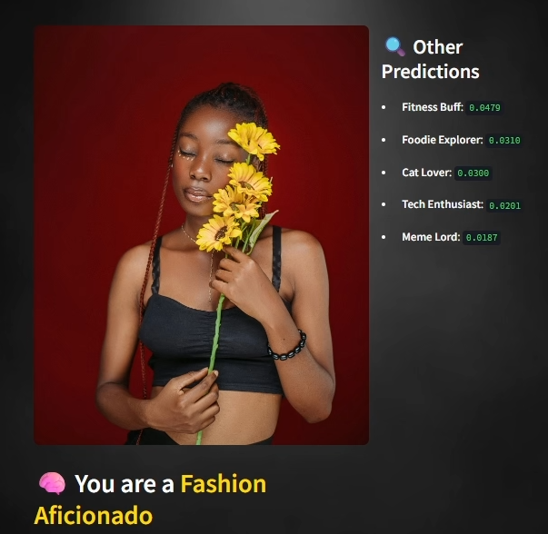

# Social Media Persona Classifier

A sophisticated machine learning application that classifies social media users into different persona categories using RoBERTa-based models with continuous training and human-in-the-loop feedback.


## 🏗️ Project Structure

```
Social-Media-Persona-Classifier/
├── app.py                          # Main application entry point
├── requirements.txt                 # Python dependencies
├── Dockerfile                      # Container configuration
├── pytest.ini                      # Test configuration
├── .gitattributes                  # Git attributes
├── .github/                        # GitHub workflows and templates
├── assets/                         # Static assets
│   ├── images/                     # Image assets
│   └── videos/                     # Video assets
├── config/                         # Configuration files
│   └── config.example.json         # Example configuration
├── data/                           # Data management
│   ├── raw/                        # Raw data files
│   └── processed/                  # Processed data files
├── docs/                           # Documentation
│   ├── PERFORMANCE_OPTIMIZATION_README.md
│   └── VALIDATION_README.md
├── models/                         # Trained models
├── scripts/                        # Utility scripts
│   ├── performance_example.py
│   ├── test_validation.py
│   └── test_runner.py
├── src/                            # Source code
│   ├── core/                       # Core application logic
│   │   ├── __init__.py
│   │   └── settings.py             # Application settings
│   ├── services/                   # Business logic services
│   │   ├── __init__.py
│   │   ├── prediction_service.py   # Prediction functionality
│   │   ├── model_training_service.py # Model training
│   │   └── feedback_service.py     # Feedback processing
│   ├── utils/                      # Utility functions
│   │   ├── __init__.py
│   │   └── data_validator.py       # Data validation utilities
│   ├── models/                     # Data models
│   │   └── __init__.py
│   └── ui/                         # User interface components
│       ├── app_pages.py            # Application pages
│       └── theme_manager.py        # UI theme management
└── tests/                          # Test suite
    ├── __init__.py
    ├── conftest.py                 # Test configuration
    ├── README.md                   # Test documentation
    ├── e2e/                        # End-to-end tests
    ├── integration/                # Integration tests
    └── unit/                       # Unit tests
```

## 🚀 Features

- **Advanced ML Pipeline**: RoBERTa-based text classification with fault tolerance
- **Continuous Training**: Human-in-the-loop feedback integration
- **Performance Optimization**: Caching, circuit breakers, and health monitoring
- **Professional UI**: Modern Streamlit interface with theme management
- **Comprehensive Testing**: Unit, integration, and end-to-end tests
- **Production Ready**: Docker support, configuration management, and monitoring

## 📋 Requirements

- Python 3.8+
- PyTorch
- Transformers
- Streamlit
- See `requirements.txt` for complete list

## 🛠️ Installation

1. **Clone the repository**:
   ```bash
   git clone <repository-url>
   cd Social-Media-Persona-Classifier
   ```

2. **Install dependencies**:
   ```bash
   pip install -r requirements.txt
   ```

3. **Configure the application**:
   ```bash
   cp config/config.example.json config/config.json
   # Edit config/config.json with your settings
   ```

4. **Run the application**:
   ```bash
   python app.py
   ```

## 🧪 Testing

Run the complete test suite:
```bash
python scripts/test_runner.py
```

Or run specific test categories:
```bash
# Unit tests
pytest tests/unit/

# Integration tests
pytest tests/integration/

# End-to-end tests
pytest tests/e2e/
```

## 📊 Performance

The application includes advanced performance optimizations:
- **Caching**: In-memory prediction caching
- **Fault Tolerance**: Circuit breakers and fallback models
- **Health Monitoring**: Automatic model health checks
- **Memory Management**: Efficient resource utilization

See `docs/PERFORMANCE_OPTIMIZATION_README.md` for detailed performance guidelines.

## 🔧 Configuration

The application uses a centralized configuration system. Key configuration options:

- **Model Settings**: Model paths, fallback configurations
- **Performance**: Cache settings, batch sizes, memory limits
- **Security**: Rate limiting, input validation
- **Monitoring**: Logging levels, metrics collection

## 📈 Model Training

The application supports continuous model training with human feedback:

1. **Data Collection**: Automatic feedback collection from UI
2. **Model Retraining**: Scheduled retraining with new data
3. **Performance Monitoring**: Automatic model evaluation
4. **Version Control**: Model versioning and rollback capabilities

## 🐳 Docker Support

Build and run with Docker:
```bash
docker build -t persona-classifier .
docker run -p 8501:8501 persona-classifier
```

## 📝 Documentation

- **Performance Guide**: `docs/PERFORMANCE_OPTIMIZATION_README.md`
- **Validation Guide**: `docs/VALIDATION_README.md`
- **Test Documentation**: `tests/README.md`

## 🤝 Contributing

1. Fork the repository
2. Create a feature branch
3. Make your changes
4. Add tests for new functionality
5. Submit a pull request

## 📄 License

This project is licensed under the MIT License - see the LICENSE file for details.

## 🆘 Support

For issues and questions:
1. Check the documentation in the `docs/` folder
2. Review existing issues
3. Create a new issue with detailed information

---

**Note**: This is a professional-grade machine learning application with production-ready features including fault tolerance, monitoring, and continuous training capabilities.

